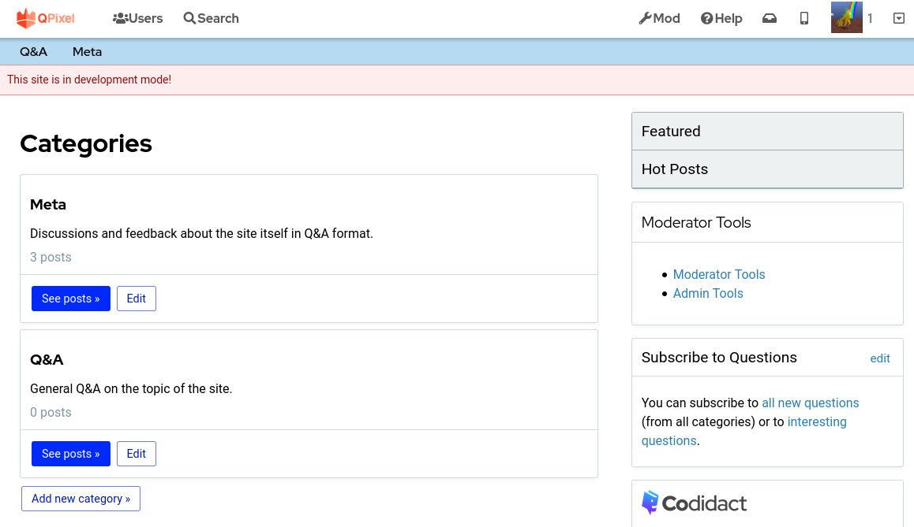

# Docker Installation

A [docker-compose.yml](../docker-compose.yml) file is provided for deployment with Docker compose, if you choose.

To use docker compose, you need to install the docker-compose-plugin. For a system like debian or ubuntu, you can use the following command.

```bash
sudo apt-get install docker-compose-plugin
```

Depending on your setup, you may need to prefix every docker command with sudo.

## 1. Setup and Secrets

The `docker-compose.yml` file uses a `.env` file in the same directory to load dynamic values used when the docker containers are initialized.

This is useful for setting up custom values locally. Additionally, your secrets (the mysql database credentials and admin user name) are inserted into the running container through the `docker/env` file.

Both the `.env` file and the `docker/env` file are gitignored, so you can change values to suit. These files need to be copied to the correct locations with some default values. You can do this in one step by executing a bash script.

```bash
# ensure script is executable, from the project root:
chmod +x docker/local-setup.sh
docker/local-setup.sh
```

Editing the `./.env` file will modify the corresponding variables used in the docker-compose.yml file but **NOT** the environment variables in the container. Editing the `./docker/env` file will change environment variables only in the running container.

## 2. Database File
Ensure `config/database.yml` has the username and password as defined in [docker/env](docker/env) file. The `config/database.yml` should already be gitignored.

The `COMMUNITY_NAME` value defined in the `.env` file defines the initial community name on your local DB.

the `COMMUNITY_ADMIN_USERNAME`, `COMMUNITY_ADMIN_PASSWORD` and `COMMUNITY_ADMIN_EMAIL` values in the `docker/env` file define the first user you can log in as. Please note that the password should be at least 6 characters long.

## 3. Build Containers

Next, you should build the images.

```bash
docker compose build
```

If you need to just rebuild one container, you can do that too.

```bash
docker compose build uwsgi
docker compose build db
docker compose build redis
```

## 4. Start Containers

Then start your containers! 

```bash
docker compose up # append -d if you want to detach the processes, although it can be useful to see output into the terminal
Creating qpixel_redis_1 ... done
Creating qpixel_db_1    ... done
Creating qpixel_uwsgi_1 ... done
```

The uwsgi container has a sleep command for 15 seconds to give the database a chance to start,
so don't expect to see output right away. After about 20 seconds, check to make sure the server is running (and verify port 3000, note that you can change this mapping in the `.env` file)

```
uwsgi_1  | => Booting Puma
uwsgi_1  | => Rails 5.2.4.3 application starting in development 
uwsgi_1  | => Run `rails server -h` for more startup options
uwsgi_1  | Puma starting in single mode...
uwsgi_1  | * Version 3.12.6 (ruby 2.6.5-p114), codename: Llamas in Pajamas
uwsgi_1  | * Min threads: 0, max threads: 16
uwsgi_1  | * Environment: development
uwsgi_1  | * Listening on tcp://localhost:3000
uwsgi_1  | Use Ctrl-C to stop
```

You should then be able to open your browser to [http://localhost:3000](http://localhost:3000)
and see the interface. 


You can then click "Sign in" to login with what you defined for `$COMMUNITY_ADMIN_EMAIL` and `$COMMUNITY_ADMIN_PASSWORD`. Importantly, your password must be 6 characters or longer, otherwise the user won't be created.

## 5. Login

Once you are logged in, you should see your icon in the top right:


## 6. Configure Categories

Before you try to create a post we need to configure categories! 
Go to `http://localhost:3000/categories/`



 Click "edit" for each category and scroll down to see the "Tag Set" field. This
 will be empty on first setup.


You will need to select a tag set for each category! For example, the Meta category can be
associated with the "Meta" tag set, and the Q&A category can be associated with "Main"


Make sure to click save for each one.

## 7. Create a Post

You should then be able to create a post! There are character requirements for the
body and title, and you are required at least one tag.


And then click to "Save Post in Q&A"


That's it!

## 8. Accessing emails
Running in this docker-compose setup, the system does not actually send emails. However, you can see the emails that would have been sent by going to [http://localhost:3000/letter_opener](http://localhost:3000/letter_opener).
This is especially useful to confirm other accounts that you make in the container.

### 9. Running commands in the docker container
Often, it may be useful to run some ruby/rails code directly, e.g. for debugging purposes. YOu can do so with the following command:

```bash
$ docker compose exec uwsgi rails runner "<ruby code here>"
Running via Spring preloader in process 111
```

It is also possible to open up a rails console to do more complicated things:

```bash
$ docker compose exec uwsgi rails c
```

Please keep in mind that for database related actions to work as expected, you first need to run the following in the rails console.

```ruby
RequestContext.community = Community.first
```

This correctly scopes all database actions to the first (and probably only) community in your system.

### 10. Stop Containers

When you are finished, don't forget to clean up.

```bash
docker compose stop
docker compose rm
```

### 11. Next steps

The current goal of this container is to provide a development environment for
working on QPixel. This deployment has not been tested with email notifications
enabled / set up, nor to deploy in production mode. If you require these 
modifications, please [open an issue](https://github.com/codidact/qpixel/issues).
